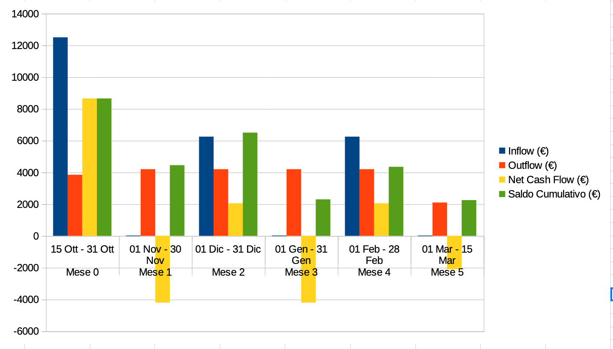
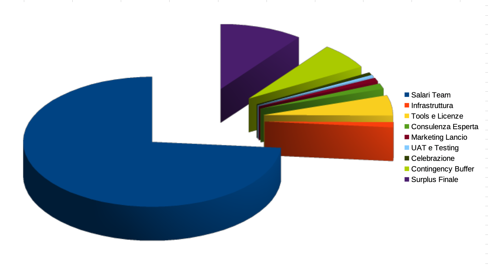

# Allegato 3.4 - Cash Flow Management
## v.1.5.0 – 2026-08-23

> Per la versione visiva compatta (da usare come allegato PDF), vedi `Allegato3.4-CashFlow.html`: apri il file nel browser e usa "Stampa → Salva come PDF". Contiene statistiche chiave, il grafico Cash Flow mensile e la ripartizione spese per categoria, generati direttamente dai valori verificati di questo documento — sostituiscono le immagini PNG sotto, che mostrano dati superati (vedi nota nella sezione "Visualizzazione Grafica Cash Flow Mensile").

La gestione del Cash Flow è critica per il successo del progetto MaraffaOnline, considerando il budget limitato di **€25.000** e la durata di **7 mesi** (15 ottobre 2025 - 15 maggio 2026). Questo documento traccia tutti i flussi finanziari in entrata (inflow) e in uscita (outflow) su base mensile, con visualizzazioni grafiche professionali.

---

## Tabella Cash Flow Mensile

| Mese | Periodo | Inflow (€) | Outflow (€) | Netto mensile (€) | Net Cash Flow / Saldo Cumulativo (€) |
|------|---------|------------|-------------|-------------------|----------------------|
| **Mese 0** | 15 Ott - 31 Ott | €12.500 | €3.000 | €9.500 | €9.500 |
| **Mese 1** | 01 Nov - 30 Nov | €0 | €3.700 | -€3.700 | €5.800 |
| **Mese 2** | 01 Dic - 31 Dic | €6.250 | €3.700 | €2.550 | €8.350 |
| **Mese 3** | 01 Gen - 31 Gen | €0 | €3.700 | -€3.700 | €4.650 |
| **Mese 4** | 01 Feb - 28 Feb | €6.250 | €3.700 | €2.550 | €7.200 |
| **Mese 5** | 01 Mar - 31 Mar | €0 | €2.000 | -€2.000 | €5.200 |
| **Mese 6** | 01 Apr - 30 Apr | €0 | €1.800 | -€1.800 | €3.400 |
| **Mese 7** | 01 Mag - 15 Mag | €0 | €1.150 | -€1.150 | €2.250 |
| **TOTALE** | | **€25.000** | **€22.750** | **€2.250** | **€2.250** |

**Note**:
- **Inflow**: pagamenti ricevuti da Maraffa Forever in 3 tranche (50% upfront, 25% a valle del Backend Core, 25% al completamento del core di gioco)
- **Nomenclatura** (come da corso): il **Net Cash Flow** è la differenza dei totali cumulati (Inflow Tot. − Outflow Tot.) — è l'ultima colonna, e un valore negativo richiederebbe finanziamenti; il *netto mensile* (inflow − outflow del mese) è una colonna di appoggio.
- **Outflow**: spese operative mensili (salari, hosting, tools, licenze), più contenute nella coda del progetto (Mesi 5-7) quando il team si riduce alle attività di testing, UAT e lancio
- **Saldo Finale**: €2.250 di surplus destinato a contingency e celebrazione lancio

### Visualizzazione Grafica Cash Flow Mensile

> **Nota.** L'immagine seguente è stata generata prima della ridistribuzione del Cash Flow su 7 mesi (v.1.2.0) e mostra ancora i valori superati a 6 mesi (outflow Mese 1-4 a €4.200, saldo minimo €2.300 nel Mese 3). Non è stata rigenerata in Excel. Per i valori corretti, aggiornati alla tabella di questo documento, vedi il grafico nel companion `Allegato3.4-CashFlow.html`.

Il grafico seguente illustra l'andamento del Cash Flow durante i 7 mesi del progetto:

**Analisi del Grafico**:
- **Barre Verdi**: Inflow (pagamenti committente) concentrati in 3 momenti chiave (Mese 0, 2, 4)
- **Barre Rosse**: Outflow (spese operative) sostanzialmente costanti nei Mesi 1-4 (€3.700), più bassi nel Mese 0 (setup, mezzo mese) e in progressiva riduzione nei Mesi 5-7 (testing, UAT e lancio con team ridotto)
- **Linea Arancione**: Saldo cumulativo sempre positivo, con minimo di €2.250 nel Mese 7

**Insight**: Il saldo cumulativo non scende mai sotto €2.250, garantendo liquidità sufficiente per coprire le spese operative in ogni fase del progetto. La struttura di pagamento 50/25/25 è efficace per mantenere il cash flow positivo per tutti i 7 mesi, anche nei mesi privi di inflow (1, 3, 5, 6, 7).

---

## Struttura Pagamenti Committente (Inflow)

| Tranche | Data | Importo (€) | % del Totale | Condizione |
|---------|------|-------------|--------------|------------|
| **1° Pagamento** | 15 Ott 2025 | €12.500 | 50% | Firma contratto + kickoff meeting |
| **2° Pagamento** | 15 Dic 2025 | €6.250 | 25% | Backend Core completo (M2) |
| **3° Pagamento** | 15 Feb 2026 | €6.250 | 25% | Completamento core di gioco (Game Engine, Backend, Real-Time) |
| **TOTALE** | | **€25.000** | **100%** | |

**Razionale**: Struttura pagamenti standard per progetti a budget fisso. Il 50% upfront garantisce liquidità iniziale per setup team e infrastruttura. I pagamenti successivi sono legati a milestone misurabili. Poiché l'ultimo inflow è a metà progetto (15 Feb), la seconda metà (Mar-Mag) è finanziata interamente dal saldo cumulativo accumulato: per questo l'outflow viene ridotto nei Mesi 5-7, mantenendo il saldo positivo fino al lancio.

---

## Dettaglio Spese Mensili (Outflow)

La tabella seguente riporta la ripartizione dell'outflow per categoria in ciascun mese. Ogni riga somma all'outflow del mese e ogni colonna somma al totale di categoria riportato più avanti.

| Mese | Salari | Infrastruttura | Tools e Licenze | Consulenza | Marketing/UAT/Celebr. | Contingency | Totale Outflow |
|------|-------:|---------------:|----------------:|-----------:|----------------------:|------------:|---------------:|
| **Mese 0** (15-31 Ott) | €2.300 | €0 | €97 | €0 | €0 | €603 | **€3.000** |
| **Mese 1** (Nov) | €2.800 | €50 | €163 | €150 | €0 | €537 | **€3.700** |
| **Mese 2** (Dic) | €2.700 | €50 | €163 | €0 | €0 | €787 | **€3.700** |
| **Mese 3** (Gen) | €2.800 | €50 | €163 | €0 | €0 | €687 | **€3.700** |
| **Mese 4** (Feb) | €2.800 | €50 | €163 | €0 | €0 | €687 | **€3.700** |
| **Mese 5** (Mar) | €1.500 | €50 | €163 | €0 | €0 | €287 | **€2.000** |
| **Mese 6** (Apr) | €800 | €25 | €100 | €150 | €0 | €725 | **€1.800** |
| **Mese 7** (01-15 Mag) | €300 | €0 | €99 | €0 | €400 | €351 | **€1.150** |
| **TOTALE** | **€16.000** | **€275** | **€1.111** | **€300** | **€400** | **€4.664** | **€22.750** |

**Note di dettaglio**:
- **Salari** (€16.000): 5 persone. Il Mese 0 (mezzo mese, setup) e i Mesi 5-7 (fase finale con team progressivamente ridotto a testing, UAT e lancio) hanno importi più contenuti; i mesi centrali di sviluppo pieno (1-4) sono i più onerosi.
- **Infrastruttura** (€275): server dedicato Hetzner (≈€50/mese) attivo dal Mese 1. Nel Mese 7 la voce è nulla perché il deploy in produzione è a carico di Maraffa Forever (come da accordi contrattuali, vedi Cap. 6 - Closing).
- **Tools e Licenze** (€1.111): dominio maraffaonline.it (€15 una tantum nel Mese 0) più abbonamenti software mensili (Figma Pro €75, JetBrains €25, Zoom Pro €13, Notion €50 = €163/mese), con quote ridotte nei mezzi mesi (0 e 7).
- **Consulenza** (€300): Francesca Giuliani (esperta Maraffa Forever) per la validazione delle regole, in due sessioni da €150 — Novembre 2025 (Mese 1) e Aprile 2026 (Mese 6).
- **Marketing/UAT/Celebrazione** (€400): tutte concentrate nel Mese 7 (fase di lancio) — comunicazione social €200, compenso simbolico ai 10 tester della community €100, team celebration €100.
- **Contingency**: buffer per imprevisti e change request distribuito su tutti i mesi (totale €4.664, pari al 18,7% del budget).

Molti servizi cloud sono utilizzati in free tier e quindi non generano costi: PostgreSQL (incluso nel server), Cloudflare CDN, UptimeRobot, Sentry (error tracking), SendGrid (email transazionali), Cloudinary (storage avatar), BrowserStack (cross-browser testing), Let's Encrypt (SSL), GitLab CI (piano free).

---

## Dettaglio Spese per Categoria (7 mesi)

| Categoria | Totale (€) | % del Budget | Note |
|-----------|------------|--------------|------|
| **Salari Team** | €16.000 | 64.0% | 5 persone su 7 mesi (part-time nel Mese 0 e nella coda Mesi 5-7) |
| **Infrastruttura** | €275 | 1.1% | Server dedicato Hetzner ≈€50/mese (attivo dal Mese 1; deploy finale a carico del committente) |
| **Tools e Licenze** | €1.111 | 4.4% | Figma, JetBrains, Zoom, Notion, Dominio |
| **Consulenza Esperta** | €300 | 1.2% | Francesca Giuliani (validazione regole, 2 sessioni) |
| **Marketing Lancio** | €200 | 0.8% | Comunicazione social per community |
| **UAT e Testing** | €100 | 0.4% | Compenso tester Maraffa Forever |
| **Celebrazione** | €100 | 0.4% | Team celebration post-lancio |
| **Contingency Buffer** | €4.664 | 18.7% | Imprevisti + change requests + buffer per progetto di 7 mesi |
| **TOTALE SPESE** | **€22.750** | **91.0%** | |
| **Surplus Finale** | **€2.250** | **9.0%** | Reserve per fase post-lancio |

### Visualizzazione Grafica Distribuzione Spese

Il grafico seguente mostra la distribuzione percentuale delle spese per categoria:

**Analisi del Grafico**:
- **Salari Team (64%)**: La voce di spesa predominante, coerente con un progetto ad alta intensità di lavoro qualificato (5 persone per 7 mesi, con impegno ridotto nel setup iniziale e nella fase finale)
- **Contingency Buffer (18.7%)**: Buffer ampio coerente con l'estensione del progetto a 7 mesi e con le best practices PM per progetti software con scope evolutivo e change requests potenziali
- **Tools e Licenze (4.4%)**: Costi contenuti grazie all'utilizzo di free tier per molti servizi cloud
- **Infrastruttura (1.1%)**: Spese minime grazie a server dedicati economici (Hetzner ≈€50/mese)
- **Surplus Finale (9%)**: Riserva per imprevisti post-lancio e scalabilità iniziale

**Insight**: L'allocazione del budget è ottimizzata per massimizzare il valore del team di sviluppo (64%), mantenendo contenuti i costi infrastrutturali (1.1%) e garantendo un margine di sicurezza complessivo del 27,7% (Contingency 18,7% + Surplus 9,0%) per gestire imprevisti e change requests in un progetto di 7 mesi.

---

## Analisi Rischi Finanziari

### Rischio 1: Ritardo Pagamento Committente
**Probabilità**: Bassa
**Impatto**: Alto
**Mitigazione**:
- Contratto firmato con penali per ritardi pagamento
- Milestone pagamenti legate a deliverable misurabili
- Comunicazione trasparente con Giovanni Marchetti (committente)

### Rischio 2: Scope Creep (Espansione Requisiti)
**Probabilità**: Media
**Impatto**: Alto
**Mitigazione**:
- MoSCoW rigoroso: solo Must Have nel MVP
- Change Request Process formale (se nuovo requisito → rivalutare budget)
- Buffer contingency del 18.7% per piccole estensioni e change requests
- **Se scope creep significativo**: rinegoziare contratto o spostare feature a v1.1

### Rischio 3: Costi Infrastruttura Superiori al Previsto
**Probabilità**: Bassa
**Impatto**: Medio
**Mitigazione**:
- Server dedicato a costo fisso (€50/mese garantito da Hetzner)
- Free tier per tools secondari (Cloudflare, Sentry, SendGrid)
- **Se traffico esplode post-lancio**: upgrade server finanziato da budget operativo v1.1

### Rischio 4: Turnover Team Member
**Probabilità**: Bassa
**Impatto**: Alto
**Mitigazione**:
- Documentazione continua su Notion
- Pair programming e code review (knowledge sharing)
- Contratti a progetto con clausole di uscita anticipata (penale)

---

## Cash Flow Variance Analysis

**Target Outflow**: €22.750 (budget pianificato)
**Threshold Warning**: Se l'outflow di un mese supera del 10% l'outflow pianificato per quel mese
**Threshold Critical**: Se il saldo cumulativo scende sotto €1.000

**Azioni Correttive**:
1. **Variance 5-10%**: Review spese non essenziali (marketing, tools premium)
2. **Variance 10-15%**: Posticipare feature Should Have/Could Have
3. **Variance >15%**: Escalation a Giovanni Marchetti per rinegoziazione budget

**Responsabile Tracking**: Marco Venturi (Project Manager)
**Frequenza Review**: Settimanale (ogni venerdì durante Project Status Meeting)

---

## Break-Even Analysis

**Question**: Quando il progetto diventerà profittevole per PlayHeritage Labs?

**Scenario Post-MVP**:
- **Ipotesi**: 500 utenti registrati nei primi 3 mesi post-lancio
- **Monetizzazione**: Modello freemium (abbonamento Premium €4.99/mese per feature avanzate)
- **Conversion rate**: 5% (25 utenti Premium)
- **Revenue mensile**: 25 × €4.99 = €124.75/mese
- **Costi operativi mensili**: ≈€200/mese (hosting + tools)
- **Break-even**: Mai raggiunto con questi numeri

**Scenario Ottimistico** (1.000 utenti, 10% conversion):
- 100 utenti Premium × €4.99 = €499/mese
- Break-even: al netto dei costi operativi (€499 − €200 = €299/mese di margine), raggiunto dopo ≈84 mesi, circa 7 anni (ROI negativo a breve termine)

**Conclusione**: MaraffaOnline è un progetto **non-profit** per la community Maraffa Forever. Il budget €25.000 copre sviluppo MVP, ma monetizzazione futura richiede strategia diversa (es. sponsorizzazioni, tornei a pagamento, crowdfunding).

---

## Approval e Trasparenza Finanziaria

**Meeting di condivisione e approvazione del piano di Cash Flow**: 27/10/2025 *(il budget complessivo e la struttura di pagamento erano già stati confermati con l'approvazione dello Scoping del 02/10 e contrattualizzati alla firma del 15/10; questo meeting approva la ripartizione operativa delle spese)*
**Partecipanti**:
- Giovanni Marchetti (Project Sponsor, Maraffa Forever)
- Marco Venturi (Project Manager, PlayHeritage Labs)
- Elena Rossi (Tech Lead, PlayHeritage Labs)

**Decisioni Approvate**:
1. Budget €25.000 confermato (no incrementi)
2. Struttura pagamenti 50/25/25 accettata
3. Contingency buffer 18.7% ritenuto adeguato per progetto 7 mesi
4. Costi salari team (64% budget) giustificati per competenze richieste
5. Richiesta: report mensile cash flow inviato a Giovanni Marchetti entro il 5 di ogni mese

**Trasparenza**: Tutti i movimenti finanziari sono tracciati su Google Sheets condiviso con committente (accesso read-only).

---

<!-- Sezione "Fonti e Riferimenti" commentata (link a blog esterni, non necessari in un allegato di progetto). Reinseribile o sostituibile con fonti del corso; registro in Relazione/_appunti-per-relazione.md.
## Fonti e Riferimenti

Questo documento è stato redatto seguendo le best practices di Cash Flow Management 2026:
- [Cube Software - Best Cash Flow Management Tools](https://www.cubesoftware.com/blog/best-cash-flow-management-software-tools)
- [Savant Labs - Cash Flow Forecasting Software](https://savantlabs.io/blog/cash-flow-forecasting-tools/)
- [Vena Solutions - Cash Flow Management Guide](https://www.venasolutions.com/blog/best-cash-flow-management-software-tools)
- [American Express - Cash Flow Management Tools](https://www.americanexpress.com/en-us/business/trends-and-insights/articles/7-cash-flow-management-tools-worth-checking-out/)
-->

---

**Redatto da**: Marco Venturi (Project Manager, PlayHeritage Labs)
**Revisionato da**: Elena Rossi (Tech Lead)

**Storico revisioni**:
- **v.1.5.0**: Audit teorico: nomenclatura allineata alle slide — il Net Cash Flow è calcolato sui totali cumulati (colonna del saldo); il netto mensile è colonna di appoggio.
- **v.1.4.0**: Chiarita la natura del meeting del 27/10 (approvazione del piano operativo di Cash Flow, non del budget — già contrattualizzato il 15/10).
- **v.1.3.0**: Aggiunto il companion `Allegato3.4-CashFlow.html` con grafici nativi (SVG generati da script dai valori verificati della tabella corrente): Cash Flow mensile e ripartizione spese per categoria. Aggiunta nota che segnala come superate le immagini PNG esistenti (`img/cash-flow-maraffaonline.png`, generata pre-v.1.2.0 e mai rigenerata: mostra ancora 6 mesi e valori pre-ridistribuzione).
- **v.1.2.0**: Ridistribuzione del Cash Flow sui 7 mesi effettivi del progetto (15 Ott 2025 - 15 Mag 2026). Tabella mensile estesa da 6 a 8 righe (Mese 0-7), outflow ridistribuiti con riduzione progressiva nella coda (testing/UAT/lancio), dettaglio spese per mese e per categoria resi internamente coerenti (righe = outflow mensile, colonne = totali di categoria). Totali invariati: inflow €25.000, outflow €22.750, surplus €2.250. Saldo minimo €2.250 (Mese 7).
- **v.1.1.0**: Aggiunta visualizzazione grafica Cash Flow mensile (img/cash-flow-maraffaonline.png) e distribuzione spese per categoria (img/spese-categorie.png), con analisi interpretativa e insights chiave.

**Prossimo Review**: 31/10/2025 (venerdì, fine Mese 0)
