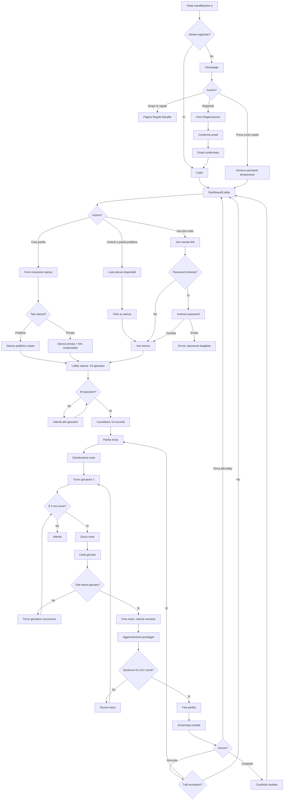

# Allegato 2.10 - User Flow
## v.1.0.0 – 2025-09-29 11:00:00

Il **User Flow** descrive i percorsi che gli utenti possono seguire all'interno della piattaforma MaraffaOnline, dalla prima visita fino al completamento di una partita. Questo documento aiuta a visualizzare l'esperienza utente e identificare eventuali punti di attrito.

---

## Flusso Principale: Nuovo Utente → Prima Partita



---

<!-- ## Flusso 1: Registrazione e Primo Accesso

### Scenario: Utente nuovo che vuole registrarsi

**Starting Point**: Homepage `maraffaonline.it`

```
┌─────────────────────────────────────────────────────┐
│ Step 1: HOMEPAGE                                    │
├─────────────────────────────────────────────────────┤
│ Utente legge tagline:                               │
│ "La Maraffa tradizionale romagnola, ora online"     │
│                                                     │
│ Opzioni visibili:                                   │
│ • [Accedi] (top-right)                              │
│ • [Registrati] (top-right)                          │
│ • [Inizia a giocare] (CTA primario)                 │
│ • [Scopri le regole]                                │
│ • [Prova come ospite]                               │
│                                                     │
│ Utente clicca → [Registrati]                        │
└─────────────────────────────────────────────────────┘
                      ↓
┌─────────────────────────────────────────────────────┐
│ Step 2: FORM REGISTRAZIONE                          │
├─────────────────────────────────────────────────────┤
│ Campi richiesti:                                    │
│ • Email: [____________]                             │
│ • Username: [____________]                          │
│ • Password: [____________]                          │
│ • Conferma password: [____________]                 │
│ • [ ] Accetto Privacy Policy e Termini              │
│                                                     │
│ Validazione real-time:                              │
│ [+] Email valida e non già registrata                │
│ [+] Username univoco                                 │
│ [+] Password min 8 caratteri (1 maiuscola, 1 numero) │
│ [+] Password coincidenti                             │
│                                                     │
│ Utente compila e clicca → [Registrati]              │
└─────────────────────────────────────────────────────┘
                      ↓
┌─────────────────────────────────────────────────────┐
│ Step 3: CONFERMA EMAIL                              │
├─────────────────────────────────────────────────────┤
│ Messaggio di successo:                              │
│ "[+] Registrazione completata!"                      │
│ "Ti abbiamo inviato un'email a [email]"            │
│ "Clicca sul link per confermare il tuo account"     │
│                                                     │
│ Utente apre email → clicca link conferma            │
└─────────────────────────────────────────────────────┘
                      ↓
┌─────────────────────────────────────────────────────┐
│ Step 4: CONFERMA AVVENUTA                           │
├─────────────────────────────────────────────────────┤
│ "[+] Email confermata! Benvenuto su MaraffaOnline"   │
│ [Accedi ora]                                        │
│                                                     │
│ Utente clicca → [Accedi ora]                        │
└─────────────────────────────────────────────────────┘
                      ↓
┌─────────────────────────────────────────────────────┐
│ Step 5: LOGIN                                       │
├─────────────────────────────────────────────────────┤
│ • Email: [____________]                             │
│ • Password: [____________]                          │
│ • [ ] Ricordami (7 giorni)                          │
│                                                     │
│ Utente inserisce credenziali → [Accedi]             │
└─────────────────────────────────────────────────────┘
                      ↓
┌─────────────────────────────────────────────────────┐
│ Step 6: DASHBOARD (primo accesso)                   │
├─────────────────────────────────────────────────────┤
│ Modale di benvenuto:                                │
│ " Benvenuto su MaraffaOnline, [Username]!"        │
│ "Sei pronto a giocare? Crea la tua prima partita"  │
│ "oppure unisciti a una stanza disponibile"          │
│ [Inizia tour guidato] [Salta]                       │
└─────────────────────────────────────────────────────┘
```

**Durata stimata**: 3-5 minuti
**Punti di attrito potenziali**:
- [!] Email di conferma finisce in spam
- [!] Password dimenticata durante primo login

**Mitigazioni**:
- Istruzioni chiare "Controlla spam se non vedi l'email"
- Link "Password dimenticata?" ben visibile

---

## Flusso 2: Accesso Ospite (Guest) → Partita Rapida

### Scenario: Utente curioso che vuole provare senza registrarsi

```
Homepage → [Prova come ospite]
    ↓
Generazione username automatica "Ospite_4729"
    ↓
Dashboard (banner: "Crea account per salvare progressi")
    ↓
[+ Crea nuova partita] oppure [Lista stanze pubbliche]
    ↓
Join stanza pubblica (es. "Partita Veloce #123")
    ↓
Lobby 3/4 → attesa 30 secondi → 4/4
    ↓
Partita inizia → gioca 10-15 minuti
    ↓
Fine partita: "VITTORIA! [+] Vuoi salvare stats? Registrati ora"
    ↓
[Crea account] → conversione a utente registrato
```

**Durata stimata**: 15-20 minuti (inclusa partita)
**Conversion goal**: 40% degli ospiti si registrano dopo prima partita

---

## Flusso 3: Creazione Stanza Privata → Invito Amici

### Scenario: Giocatore vuole giocare con amici specifici

```
Dashboard → [+ Crea nuova partita]
    ↓
┌─────────────────────────────────────────┐
│ FORM CREAZIONE STANZA                   │
│                                         │
│ Nome stanza: [Partita tra amici____]    │
│                                         │
│ Tipo:                                   │
│ (•) Privata (con password)              │
│     Password: [****]                    │
│                                         │
│ Invita giocatori:                       │
│ [ Cerca amici...]                     │
│ [✓] Marco                               │
│ [✓] Giulia                              │
│ [ ] Luca                                │
│                                         │
│ Link di invito:                         │
│ maraffaonline.it/join/ABC123            │
│ [📋 Copia link]                         │
│                                         │
│ [Crea partita]                          │
└─────────────────────────────────────────┘
    ↓
Stanza creata → Lobby 1/4
    ↓
Notifiche inviate a Marco e Giulia (in-app)
    ↓
Condivisione link su WhatsApp per terzo amico
    ↓
Amici joinano uno alla volta: 2/4 → 3/4 → 4/4
    ↓
Countdown 10 secondi → Partita inizia
```

**Features chiave**:
- [+] Invito ibrido: notifica in-app (se amici) + link condivisibile (per chiunque)
- [+] Password opzionale per maggior privacy
- [+] Owner della stanza può kickare giocatori indesiderati

---

## Flusso 4: Gameplay Completo (Una Partita)

### Dettaglio step-by-step di una partita

```
FASE 1: SETUP
├─ 4/4 giocatori in lobby
├─ Countdown 10 secondi
├─ Schermata caricamento: "Mescolamento carte..."
└─ Distribuzione 10 carte a ciascun giocatore

FASE 2: PRIMA MANO
├─ Determinazione primo giocatore (casuale)
├─ Indicatore "È il turno di [Nome]"
├─ Timer 30 secondi inizia
│
├─ TURNO GIOCATORE 1
│   ├─ Giocatore 1 clicca carta → animazione vola al centro
│   ├─ Carta visibile a tutti
│   └─ Turno passa al Giocatore 2
│
├─ TURNO GIOCATORE 2 (ripete processo)
├─ TURNO GIOCATORE 3
├─ TURNO GIOCATORE 4
│
├─ Fine turno: tutte e 4 le carte sul tavolo
├─ Calcolo vincitore mano (automatico server)
├─ Banner: "Mano vinta da COPPIA A!"
├─ Aggiornamento punteggio: "Noi 11 - Loro 0"
└─ Carte scompaiono dal tavolo, mano successiva

FASE 3: MANI SUCCESSIVE (2-10)
└─ Ripete processo FASE 2 finché qualcuno arriva a 41+ punti e una figura

FASE 4: FINE PARTITA
├─ Coppia raggiunge 41 punti e una figura
├─ Transizione schermata → " VITTORIA!"
├─ Riepilogo:
│   ├─ Punteggio finale: 41 - 38
│   ├─ Mani vinte: 9 vs 6
│   └─ Punti raccolti per coppia
│
└─ Opzioni:
    ├─ [Rivincita] → se tutti accettano, torna a FASE 1
    ├─ [Torna alla lobby] → Dashboard
    └─ [Condividi risultato] → genera link/screenshot
```

**Durata media partita**: 12-15 minuti
**Eventi real-time critici**:
- Sincronizzazione carte giocate (latency < 500ms)
- Aggiornamento punteggio istantaneo
- Notifica "È il tuo turno" (visuale + opzionale sonora)

---

## Flusso 5: Gestione Disconnessione Temporanea

### Scenario: Giocatore perde connessione WiFi durante partita

```
PARTITA IN CORSO
├─ È il turno del Giocatore 2
└─ Giocatore 3 (TU) perde connessione WiFi
    ↓
┌─────────────────────────────────────────┐
│ LATO CLIENT (Giocatore 3)               │
├─────────────────────────────────────────┤
│ Schermata: "[!] Connessione persa"       │
│ "Tentativo riconnessione..."            │
│ [Spinner animato]                       │
│                                         │
│ Retry automatico ogni 5 secondi         │
└─────────────────────────────────────────┘
    ↓
┌─────────────────────────────────────────┐
│ LATO SERVER                             │
├─────────────────────────────────────────┤
│ Rileva disconnessione Giocatore 3       │
│ Salva stato partita (snapshot)          │
│ Partita sospesa per max 5 minuti        │
│ Timer disconnessione: 00:00 → 05:00     │
└─────────────────────────────────────────┘
    ↓
┌─────────────────────────────────────────┐
│ LATO ALTRI 3 GIOCATORI                  │
├─────────────────────────────────────────┤
│ Notifica: " Giocatore 3 disconnesso"  │
│ "Attendi riconnessione... (1:23)"       │
│ Partita in pausa, chat attiva           │
└─────────────────────────────────────────┘
    ↓
SCENARIO A: Riconnessione entro 5 minuti
├─ WiFi torna online
├─ Client tenta riconnessione → successo
├─ Server invia stato salvato
├─ Giocatore 3 riprende con carte in mano, punteggio, turno correnti
├─ Notifica a tutti: "[+] Giocatore 3 è tornato!"
└─ Partita riprende normalmente

SCENARIO B: No riconnessione dopo 5 minuti
├─ Timer scade
├─ Server annulla partita
├─ Nessun vincitore dichiarato
├─ Nessuna penalità sulle statistiche
└─ Tutti i giocatori tornano alla lobby con messaggio:
    "[-] Partita annullata per disconnessione prolungata"
```

**Features chiave**:
- [+] Salvataggio automatico stato ogni mano
- [+] Buffer 5 minuti (bilanciamento tra attesa ragionevole e frustrazione)
- [+] Nessuna penalità stats per disconnessioni (evita frustrazione)

---

## Flusso 6: Gestione Sistema Amicizie

### Scenario: Aggiungere un amico e invitarlo a partita

```
Dashboard → Sezione [Amici]
    ↓
┌─────────────────────────────────────────┐
│ RICERCA AMICO                           │
│                                         │
│ [ Cerca per username...]              │
│                                         │
│ Utente digita "marco_v"                 │
│                                         │
│ Risultati:                              │
│ ┌───────────────────────────────────┐   │
│ │  marco_venturi                  │   │
│ │    Partite: 45 | Win: 54%         │   │
│ │    [+ Aggiungi amico]             │   │
│ └───────────────────────────────────┘   │
│                                         │
│ ┌───────────────────────────────────┐   │
│ │  marco_88                       │   │
│ │    Partite: 12 | Win: 42%         │   │
│ │    [+ Aggiungi amico]             │   │
│ └───────────────────────────────────┘   │
└─────────────────────────────────────────┘
    ↓
Utente clicca [+ Aggiungi amico] su marco_venturi
    ↓
┌─────────────────────────────────────────┐
│ RICHIESTA INVIATA                       │
│ " Richiesta amicizia inviata a        │
│  marco_venturi"                         │
│ "Attendi che accetti la richiesta"      │
└─────────────────────────────────────────┘
    ↓
┌─────────────────────────────────────────┐
│ LATO MARCO_VENTURI                      │
│                                         │
│ Notifica in-app (campanella):          │
│ " [Username] ti ha inviato richiesta  │
│  di amicizia"                           │
│                                         │
│ [Accetta] [Rifiuta]                     │
└─────────────────────────────────────────┘
    ↓
Marco clicca [Accetta]
    ↓
Entrambi ricevono notifica: "[+] Ora siete amici!"
    ↓
Marco appare nella lista "Amici" (stato online ●)
    ↓
INVITO A PARTITA
├─ Utente crea stanza privata
├─ Nel form, seleziona marco_venturi dalla lista amici
├─ Marco riceve notifica: "[Username] ti ha invitato a giocare"
├─ [Unisciti] [Ignora]
└─ Marco clicca [Unisciti] → join diretto alla stanza
```

---

## Diagramma Completo Navigazione Sito

```
                    maraffaonline.it
                          |
        ┌─────────────────┼─────────────────┐
        |                 |                 |
    Homepage          Login          Registrazione
        |                 |                 |
        |                 └─────┬───────────┘
        |                       |
    [Ospite]              Dashboard/Lobby ←──┐
        |                       |             |
        └───────────────────────┤             |
                                |             |
                ┌───────────────┼───────────────────┐
                |               |                   |
        Crea Partita    Unisciti Partita    Profilo/Amici
                |               |                   |
                └───────────────┤                   |
                                |                   |
                          Lobby Stanza              |
                          (4 giocatori)             |
                                |                   |
                          Partita in corso          |
                                |                   |
                          Fine Partita              |
                                |                   |
                ┌───────────────┼───────────┐       |
                |               |           |       |
            Rivincita    Torna Lobby    Condividi  |
                |               |           |       |
                └───────────────┴───────────┴───────┘
```

---

## Metriche UX da Monitorare

### Funnel di Conversione
1. **Homepage → Registrazione**: 25% (target)
2. **Registrazione → Email confermata**: 80% (target)
3. **Login → Prima partita**: 90% (target)
4. **Ospite → Registrazione**: 40% (target)

### Time-to-Value
- **Tempo medio per completare prima partita** (da arrivo su sito): < 20 minuti (target)
- **Tempo medio creazione account**: < 3 minuti (target)

### Punti di Abbandono (da ridurre)
- [!] Abbandono durante attesa giocatori in lobby: 15% (se > 2 minuti)
- [!] Abbandono durante partita per disconnessioni: < 5% (target)

---

## Allegato Visivo

Il diagramma completo del User Flow è disponibile come immagine:
- `img/user-flow-diagram.png` (creato con Figma/Miro)
- `img/user-flow-dettagliato.pdf` (versione stampabile alta risoluzione)

--- -->

**Redatto da**: Luca Moretti (UX/UI Designer, PlayHeritage Labs)
**Revisionato da**: Marco Venturi (Project Manager)
**Validato con**: 8 utenti beta tester (Think Aloud Protocol, 10/10/2025)
**Data approvazione**: 30/09/2025
